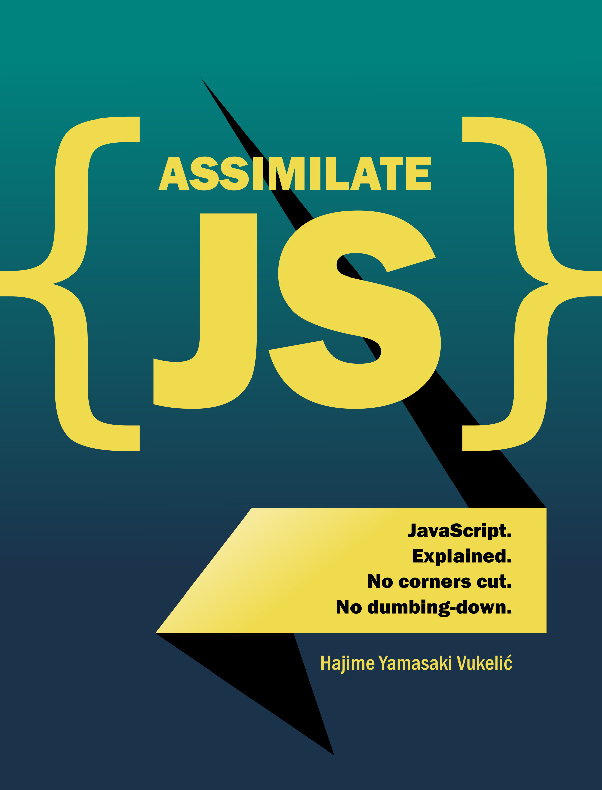

# About this book

This book is certainly not a light introduction to JavaScript. That's not to
say that this book is not for a novice JavaScript developer. It's going to be
overwhelming, but hopefully well worth it. Here's why.

The aim of this book is to provide accumulated experience of a working
JavaScript developer for each and every topic. The layers that build up as you
progress as a developers are here condensed into a single compact treatment in
each section. This book does not try to arrive at conclusions the same way you
would if you were learning on your own, and in doing so, the hope is that some
of the confusion and mystery around the concepts being discussed would be
removed.

Assimilate JS is not meant to be read cover-to-cover. Topics are mostly
self-contained, with references to other topics only as needed to understand
the current one. It is also not meant to be memorized, but read and re-read as
you run into problems that are covered herein. Even if you feel that the
material is overwhelming, I suggest you mentally bookmark the sections so you
can get back to them at some later time, when you discover that what you are
doing has some semblance to what you saw in this book.

Individual sections of this book are written as literate ECMAScript 6 modules.
This means that the code snippets embedded in the markdown comprise a complete
working program that can be executed using NodeJS. Instructions on how to get
and run the code is outlined further below.

This book is also a work in progress. New chapters are added (almost) every
week, as my time permits, or as I run into new and interesting topics I wish
to explore.

Finally, it is my hope that this book is going to end up being a collaborative
effort between you, my readers, and me. I encourage you to send me feedback by
[filing an issue on
GitHub](https://github.com/foxbunny/javascript-by-example/issues)  or
commenting directly [on the online version of the
book](https://foxbunny.gitbooks.io/assimilate-js/content/).

## Getting the sources

To obtain the sources, simply clone [the repository](
https://github.com/foxbunny/javascript-by-example/) using git, or [download](
https://github.com/foxbunny/javascript-by-example/archive/master.zip) it.

To clone the repository run:

    git clone https://github.com/foxbunny/javascript-by-example.git
    cd javascript-by-example

Then run this command in the source directory:

    npm install

This will install [Babel](https://babeljs.io/) and a few more related packages,
which enables you to run the examples.

## Running the examples

To run the examples, use `npm start [example module]` command, where `[example
module]` is the module's file name with or without the `.js` extension. For
example, if you wish to run `proto.js`, you would run this command:

    npm start proto

## Literate modules

The markdown modules are literate JavaScript modules. They are made executable
using the [literatejs](https://github.com/foxbunny/literatejs) program. There
is some boilerplate code in the
[run.js](https://github.com/foxbunny/javascript-by-example/blob/master/run.js)
script if you are curious.

## License

This code in this repository is licensed under the MIT license. See the license
file for more information.

## Reporting issues

Please use the [issue tracker](
https://github.com/foxbunny/javascript-by-example/issues) to report issues with
the examples or documentation. You are also welcome to submit pull requests
with fixes or even completely new modules.

Ideas for new topics to cover is also very welcome!

## About the author

I am a long-time web developer with over 8 years of experience programming
in JavaScript. My relationship with JavaScript has started even before frontend
engineering was *the* thing, scripting Adobe software using the JavaScript
scripting API. Although I have also done NodeJS development, my main focus
nowadays is on frontend engineering. I love JavaScript, and lately also writing
about it.

You can tweet to me, `@foxbunny`, [on Twitter](https://twitter.com/foxbunny),
and read more of the musings, that didn't quite fit this book, [on my
blog](http://hayavuk.tumblr.com/).

## Acknowledgements

I would like to thank all my friends that gave me encouragement and feedback.
In particular, I would like to mention:

- Andrean
- Manish
- Ben
- Abhishek
- Vitomir

I keep writing this book thanks to these great buddies!
