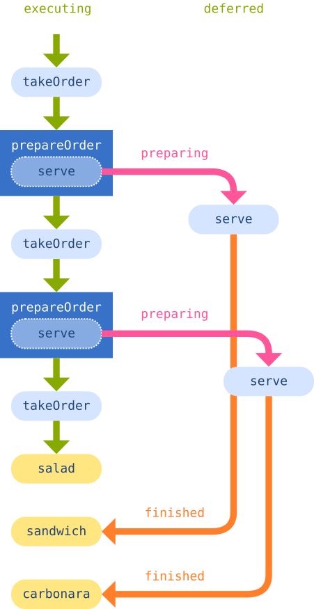
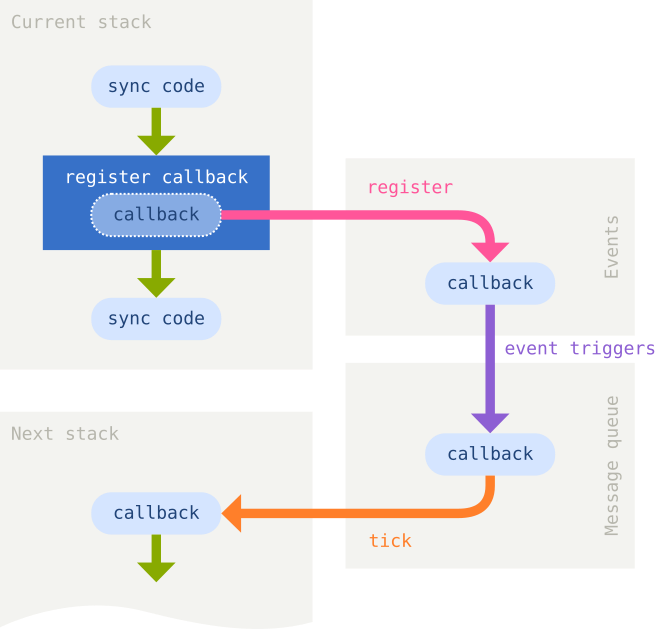

```javascript
import {NOTE} from './_util'
import async from 'async'
```

# Asynchronous programming

As you work on JavaScript projects, sooner or later you are going to encounter
the term 'asynchronous'. The aim of this module is to get you up to speed on
what this term means, as well as look at some of the patterns that we can use
to work with asynchronous code.

**NOTE:** Because of the contrived nature of asynchronous programming, we will
need to isolate examples from each other. For this purpose, you will see
examples wrapped in functions. The wrapper functions serve no other purpose
than isolation.

Before we go into the concrete examples, I'm going to tell you a story.

## The salad people never wait

Once upon a time, there were three hungry people. Their names were Bob, Mary,
and Jane.

One day, they ran into a restaurant. In the restaurant, there was a counter
where people can order food, and some tables. The three hungry people decided
to go inside and have a meal.

The restaurant was one of those first come first serve places run by the
manager, Mr. Block.

Bob walked in first, and ordered a sandwich. The cashier told him to hold on
until the food is ready. It would only take about 3 minutes to prepare the
meal, so Bob decided to wait it out.

Mary walked in immediately after bob. She, too, wanted a sandwich, but Bob was
still waiting at the counter. She had no choice but to wait in line behind Bob.

Jane walked in last looking for some salad. She could see the salad bowl behind
the counter, but Bob and Mary were already in the queue. Jane complained to Mr.
Block, but was politely asked to wait for her turn.

Jane got annoyed and walked out. Seeing that, Mary also walked out.

The store owner saw this, and fired Mr. Block on the spot. He posted an ad for
the new restaurant manager, and hired Mr. Defer a few days later.

Mr. Defer, the new manager, decided to do things a bit differently. He had a
bench placed next to the counter, and trained the employees to ask the
customers to sit and wait for the order, allowing the next customer to walk up
to the counter and order their food while previous customers are waiting. Mr.
Defer also introduced an new rule. Salad customers would not have to wait on
the bench, because they could be served immediately.

Next day, Bob, Mary, and Jane, were walking down the street and saw that the
restaurant was now run by a different person. Despite the bad experience they
had last time, they agreed to give the place a second chance.

Bob walked in first again, and ordered his sandwich. This time he was offered
a seat on the cozy bench while the meal was being prepared.

Mary walked in next, and also ordered a sandwich. She sat next to Bob to wait
for the cashier to call her name.

Jane walked in last. To her surprise, she was served the salad immediately, and
went straight to one of the empty tables to enjoy her lunch.

After about 3 minutes, both Bob's and Mary's sandwiches were ready, so they
went to the counter, one by one, to pick them up and pay.

The three hungry people sat at the table and talked about how great things have
gotten since Mr. Defer was put in charge.

Everyone was happy, and the restaurant made a lot of money.

Later, during the lunch hour rush, 40 more customers came into the restaurant.
It was a salad frenzy day, and only a handful of customers wanted sandwiches.
Bob was in the first again, and ordered a sandwich, but there were 30-someting
people ordering salads after him. One by one, salads got served, while Bob was
sitting idly on the bench.

3 minutes were up, but there were still 3 people waiting to get salads, and a
few  more people wanting a sandwich. The cashier served the 3 salad customers,
and took the order from the sandwich customer. As the sandwich person was
walking away from the counter, the cashier finally got the chance to serve Bob.

Bob was not the happiest person on the planet this time, but such are the
rules: salad people don't wait on the bench.

## Enough about the food, you're making me hungry!

OK, back to JavaScript.

Let's actually code the restaurant examples. We will first code the one that
was run by Mr. Block, and then the other one, run by Mr. Defer.

### Block's restaurant

Mr. Block's restaurant was slightly simpler. It had less rules:

- You come to the counter and order the food
- You wait for the food
- You pay and eat

```javascript
const blockRestaurant = nextExample => {
  NOTE('Mr. Block restaurant')

  const ORDER_TIMES = {
    carbonara: 1500,
    sandwich: 300,
    salad: 0
  }

  const prepareOrder = order => {
    const time = ORDER_TIMES[order]
    if (time === 0) {
      console.log(`${order} is already prepared`)
    } else {
      console.log(`Preparing ${order}, ETA: ${time}`)
      const start = (new Date).getTime()
      while ((new Date).getTime() - start < time) {
        // Cooking
      }
      console.log(`${order} is ready!`)  
    }
  }

  const takeOrder = (name, order) => {
    console.log(`${name} ordered ${order}`)
    prepareOrder(order)
    console.log(`${name} received their ${order}`)
  }

  takeOrder('Bob', 'carbonara')
  takeOrder('Mary', 'sandwich')
  takeOrder('Jane', 'salad')

  nextExample()
}
```

The output from the above example looks like this:

    NOTE: Mr. Block restaurant
    Bob ordered carbonara
    Preparing carbonara, ETA: 1500
    carbonara is ready!
    Bob received their carbonara
    Mary ordered sandwich
    Preparing sandwich, ETA: 300
    sandwich is ready!
    Mary received their sandwich
    Jane ordered salad
    salad is already prepared
    Jane received their salad

The code is more or less straightforward. There are two functions. The
`takeOrder()` function takes the order, logs what order has been taken, then
invokes the `prepareOrder()` function which prepares the order, and finally
logs that the order has been served. The `prepareOrder()` function will first
look up the time it needs to prepare the order, and it will then start a
`while` loop, wait for the timer to ring, and then deliver the order.

All of the code in the example is what we call 'synchronous' code. It means
that the JavaScript engine will execute statements one by one. It is simple,
but there's one problem with this. If you look at what the `while` loop is
doing, you will notice that it is not doing anything. The sole purpose of the
`wile` loop is to block the execution until the time's up. So wasteful!

## Mr. Defer's restaurant

Now let's take a look at Mr. Defer's restaurant.

It was a bit more complicated when it comes to rules:

- You come to the counter and order the food
- If you order a salad, you don't have to wait
- If you order something other than a salad, you wait until you're called
  to pick your order up
- While you are waiting, other customers can still order food
- When you are called back to the counter, you pay and eat

```javascript
const deferRestaurant = nextExample => {
  NOTE('Mr. Defer restaurant')

  const ORDER_TIMES = {
    carbonara: 1500,
    sandwich: 300,
    salad: 0
  }
  let ordersTaken = 0;

  const prepareOrder = (order, whenReady) => {
    const time = ORDER_TIMES[order]
    console.log(`Preparing ${order}, ETA: ${time}`)
    setTimeout(whenReady, time)
  }

  const takeOrder = (name, order) => {

    console.log(`${name} ordered ${order}`)
    if (order === 'salad') {
      console.log(`${name} does not have to wait`)
      return
    }

    ordersTaken++

    const serve = () => {
      console.log(`${name}'s ${order} is ready`)
      ordersTaken--
      if (!ordersTaken) {
        console.log('No more orders to serve, moving to next example')
        nextExample()
      }
    }

    prepareOrder(order, serve)
  }

  takeOrder('Bob', 'carbonara')
  takeOrder('Mary', 'sandwich')
  takeOrder('Jane', 'salad')
  console.log('All orders taken')
}
```

The output of the above example looks like this:

    NOTE: Mr. Defer restaurant
    Bob ordered carbonara
    Preparing carbonara, ETA: 1500
    Mary ordered sandwich
    Preparing sandwich, ETA: 300
    Jane ordered salad
    Jane does not have to wait
    All orders taken
    Mary's sandwich is ready
    Bob's carbonara is ready
    No more orders to serve, moving to next example

Before we discuss the details of the implementation, let's first talk about
the `setTimeout()` function. This function is asynchronous. In other words,
it tells the JavaScript engine to wait in background, and once the wait is
finished, execute a callback function that we pass it. This pattern is exactly
the same as any asynchronous operation that we would normally perform in real
life, including AJAX or HTTP requests, database queries, filesystem operations,
and so on.

The second example is no doubt a bit more complex than the first one, but let's
carefully break it down and analyze what it does.

The new `prepareOrder()` function takes the order name, and a `whenReady`
function that should be called when the order is ready. Instead of using a
`while` loop, it now uses `setTimeout()` to simulate asynchronously preparing
the meal without blocking code from running while the preparation is ongoing.

The `takeOrder()` function will take the order, as well as the customer's name.
We need to name so we know whom to call when the meal is ready. It takes
care of salad orders immediately. For all other orders, it will increment the
`ordersTaken` counter to keep track of unfulfilled orders.

A new function `serve()` is defined, which will decrement the counter and serve
the customer. This function is called a 'callback' because it is used by
another function to 'call us back' when an asynchronous operation is finished.
This callback function is passed to `prepareOrder()` as the `whenReady`
argument.

When finally call `takeOrder()` with the three orders. When Bob's order is
placed, a `prepareOrder()` call is made, and Bob has to wait until `serve()` is
called for his order. The `ordersTaken` is incremented by one. The same is true
for Mary's order. However, Jane's order does *not* result in an asynchronous
call. For her, the order is served immediately without requiring a callback.
After Jane's order is fulfilled, it takes a while until Mary's order is done,
and the `serve()` is called. The `ordersTaken` is decremented by one, and
has the value of 1. When Bob's order is finally served, the `ordersTaken` is
again decremented, and is now 0. This causes `serve()` to also conclude that
there are no more orders and we can go to the next example.

Let's take a look at a diagram, which will hopefully make this a bit clearer:



The green arrow represents a sequence of synchronous statements. If you are
wondering why `prepareOrder()` is counted among the synchronous statements, it
is because it is a synchronous statement that starts an asynchronous operation.
The same is true for the `setTimeout()`. We called it an 'asynchronous
function' before, but that was describing the nature of what it does internally
rather than the semantics in the code.

Purple arrows represent the asynchronous operations that are going on outside
the chain of statements that are currently executing. (The length of the arrow
does not represent anything.) The orange arrow represents the continuation,
which is when the callback code for the completed asynchronous task is
scheduled to run next.

## A bit of technical background

JavaScript engines are single threaded. If you don't know what
[threads](https://en.wikipedia.org/wiki/Thread_(computing)) are, imagine the
analogy of solving Mr. Block's problems by adding more counters instead of a
bench for customers to wait on. In other words, JavaScript is limited to a
single counter.

JavaScript has a single thread with non-blocking I/O. This means that requests
for I/O operations (file access, database operations, AJAX/HTTP requests) are
sent to the operating system (or browser), and the main thread is free to
continue until the operating system responds back with the results. The code
that orchestrates all this is called an event loop.

This design makes a lot of sense in the environment where JavaScript grew up,
which is the browser. At any time, user-initiated events may come in and
handling of such events must be scheduled as soon as possible.

The following diagram shows how the event loop works.



At any given time there is a stack of functions that needs to be run. When a
function is invoked, a new frame is created on the stack, and when a function
returns, the frame is removed from the stack. Stacks are run to completion,
until all frames return.

Within the same stack there could be calls that register callbacks for events.
`setTimeout()` for example registers a callback for a timer event. At that
point, the callback function and the event for which it is being registered
are sent out to the runtime and registered (purple arrow). As soon as
registration is completed, the stack is resumed, and executed to the end.

When an event is triggered (e.g., user clicks a button in the browser, or a
file operation completes), a matching callback that is registered for the event
is put into a message queue (violet arrow).

Every time the current stack completes, a tick occurs, where the runtime takes
the message from the message queue, and calls the callback (orange arrow). This
crates a new stack, which must run to completion.

Rinse and repeat.

## Run to completion

As we mentioned, a stack *must* run to completion. Once a function is called,
there is no way to interrupt it. It can either return, or terminate with an
exception. While a stack is executed, no ticks can happen.

This property is easy to demonstrate.

```javascript
const nextTickDemo = nextExample => {
  NOTE('Next tick demo')

  setTimeout(() => {
    console.log('Run me after 0s')
    nextExample()
  }, 0)

  const start = (new Date).getTime()
  while ((new Date).getTime() - start < 1000) {
    // Just wait for it
  }
  console.log('Run me after 1s')
}
```

The output from the above function looks like this:

    NOTE: Next tick demo
    Run me after 1s
    Run me after 0s

Even though we have scheduled the `setTimeout()` callback to run after 0
milliseconds, it was invoked after more than 1 second. The reason for this is
that the `while` loop is part of the current stack, and it kept blocking for a
second, so the callback that was scheduled had to wait for the blocked stack
to finish.

There are two important lessons here.

One lesson is that you should not consider the time you pass to `setTimeout()`
(and also `setInterval()`) as exact time until callback is invoked. This value
only means that the callback will not be added to the message queue until this
time is up, and after that it all depends on when the next tick happens.

Another thing is that the stack should never keep busy for too long. As long as
the stack is executing, a tick does not happen, and the queued callbacks cannot
be processed. This rule is valid across all stacks created in your program,
regardless of its size and complexity.

If you have a web server that is taking 10k requests, and you block for 30
seconds in the very first stack, this holds 10k requests up for 30 seconds! The
whole idea of achieving high performance and concurrency using event loops
hinges on keeping your stacks as quick as possible.

If you need to do *a lot* of computing that does not involve asynchronous I/O
(and would therefore cause the stack to return late), you cannot do that in
the main thread (solving this problem is outside the scope of this module,
but you might want to read about
[web workers](https://developer.mozilla.org/en-US/docs/Web/API/Web_Workers_API/Using_web_workers)).

## Callbacks are on their own stack

It's important to keep in mind that callbacks are called on their own stack.

This is best demonstrated by an example:

```javascript
const separateStack = nextExample => {
  NOTE('Callbacks are on separate stack')

  let x = 0

  setTimeout(() => {
    x++
    console.log('(next stack) x =', x) // 1
    nextExample()
  }, 0)

  console.log('(current stack) x =', x) // 0
}
```

In the example, we increment `x` within the callback, but the value of `x`
logged within the current stack is still 0. This is because the callback will
not be called until the current stack is finished.

Another interesting observation we can make based on this example is that the
[closure](./func.md) of the callback is retained, so the callback is able to
access the `x` variable *even though it is defined on a separate stack*.

## Return values of the callback functions

Callback functions cannot return to the caller on the current stack. Even
though the `setTimeout()` function has a return value (a `Timeout` object that
can be used to cancel the timeout), there is no way for us to obtain the return
value of the callback, ever.

If you look at the event loop diagram again, you will see that there is a gap
between the two stacks, and no green arrows between the last statement in the
current stack, and the first statement in the next stack. In other words,
execution continues with the callback. This is sort of like turning a page in a
book: you remember the last sentence on the previous page in your head, but you
cannot see it.

To clarify the last paragraph, consider this code:

```javascript
const syncWorkflow = nextExample => {
  NOTE('Synchronous workflow')

  function add(x, y) { return x + y }
  var i = add(2, 3)
  console.log('i =', i) // 5
  nextExample()
}
```

In the above code, we call `add()`. When `add()` returns, the execution
continues from the point where `add()` returned, and proceeds with assigning
the return value to `i`, and so on.

What if `add()` were asynchronous?

```javascript
const asyncWorkflow = nextExample => {
  NOTE('Asynchronous workflow')

  function add(x, y, callback) {
    setTimeout(() => {
      callback(x + y)
    }, 0)
  }

  add(3, 8, i => {
    console.log('i =', i) // 11
    nextExample()
  })
}
```

Since the callback will be called in the next stack, we need a way to work
with the result in the same stack as the callback. The solution pass the
`add()` function our own callback which will receive the result. The
`setTimeout()` callback will then invoke our callback once the result of the
addition is known, and our callback function then continues with further work.
You can think of it as wrapping in a function any unfinished business from the
current stack, and passing that to the event callback to have the unfinished
business resumed.

In other words, the stuff we did after `var i = add(...)` in the first example,
becomes part of the callback function we pass to `add()`. The event loop will
then arrange the code to run in the correct order.

This style of programming is also known as 'continuation passing style' (CPS),
and the function we passed to `add()` is called 'continuation'.

## Synchronization

Unlike in our small examples, the message queue can get quite busy in real
world programs. It can become very difficult to reason about the order in which
the callbacks are going to be fire, if not outright impossible. (In fact,
you should generally not rely on making assumptions about the order.)

At the same time, there may be cases where order in which the callbacks are
executed does matter.

In this section, we will take a look at two common scenarios, and how
synchronizing the callbacks works.

### Parallel: finish all asynchronous operations in any order

In this case, we may have several asynchronous operations that have a common
continuation, but the order of operations does not matter. In other words, we
just want to run a function when *all* operations are finished.

In the example code, we simulate code that processes images asynchronously. We
have a list of image names, and for each image, we will invoke `setTimeout()`
as a mock asynchronous operation.

```javascript
const commonContinuation = nextExample => {
  NOTE('Unordered async operations')

  const images = ['image1', 'image2', 'image3', 'image4']
  let numtasks = images.length

  const cont = () => {
    numtasks--
    if (numtasks) return // more tasks to complete
    console.log('All images processed')
    nextExample()
  }

  images.forEach(image => setTimeout(() => {
    console.log('Processed image ' + image)
    cont()
  }, randomTimeout()))
}
```

The order in which images are processed are not important here, so we schedule
the processing for all four images at once (in quick succession). The I/O
operations on the images supposedly take place in the background, more or less
in parallel for all practical purposes. The callbacks are then put on the
message queue in the order in which the processing finishes.

The `cont()` callback basically postpones continuation until all images are
processed. It does so by keeping track of how many images are still processing
(the `numtasks` variable). Once there are no more images, it continues to the
next example.

### Sequential: finish all asynchronous operations in specific order

In this case, the order of the operations matters, perhaps because we want
the asynchronous operations to depend on each other.

We will write an example of some code that simulates retrieving a value from
a database, and then uses that value to read a file whose filename matches the
value, and then sends the file contents to a server. Of course, we won't
actually do all these things, but we'll use `setTimeout()` to simulate.

```javascript
const asyncSequence = nextExample => {
  NOTE('Ordered async operations')

  let tasks = []

  const next = (val) => {
    if (tasks.length) {
      tasks.shift()(val, next)
    } else {
      console.log('Last task complete')
      nextExample()
    }
  }

  const getValue = (query, callback) => {
    setTimeout(() => {
      console.log('Retrieved value from database with query ' + query)
      callback('foo')
    }, randomTimeout())
  }

  const readFile = (name, callback) => {
    setTimeout(() => {
      console.log('Read file ' + name + '.csv')
      callback(name + '.csv contents')
    }, randomTimeout())
  }

  const sendData = (data, callback) => {
    setTimeout(() => {
      console.log('Sending ' + data)
      callback()
    }, randomTimeout())
  };

  tasks.push(getValue)
  tasks.push(readFile)
  tasks.push(sendData)

  next('name == foo')
}
```

First of all, we cheated a bit. Since we were free to design our own API for
the three functions, we made it so that they can neatly be chained. We made
sure that they all take a value as their first argument, and a callback as
their second. We also made sure that the callback is always passed a single
argument. This allowed us to write a driver function called `next()`, which
keeps the chain going.

The driver uses a list of tasks to organize the ordering. It receives a value
as its only argument, and grabs the first item in the task list, then calls the
task function  passing in the value it received, and itself as a callback. By
passing itself to tasks, `next()` ensures that the control over the flow is
returned to it after each task. The task function will invoke `next()` again,
passing the value it calculated, and the loop continues until we are out of
tasks. (And yeah, this is a recursive function, in case you were wondering.)

The rest of the code is pretty straightforward, so I won't go into it.

When working with 3rd party APIs, you should be keenly aware of all the
functions that are involved, and their signatures. Wrap them as necessary to
produce chainable calls like we have in our example. Not taking the time to do
this will lead to spaghetti that is very difficult to manage.

## Pyramid of doom

In the previous section, you have seen a neat way to string asynchronous
operations together. This section is dedicated to the wrong way to do
continuation passing. Although the code in the example works, you will see
how it can be a very bad idea.

A common term for code that looks like this is the 'pyramid of doom' or
'callback hell'.

```javascript
const pyramidOfDoom = nextExample => {
  NOTE('Pyramid of doom demo')

  let x = 1

  setTimeout(() => {
    x++
    console.log('1: x ===', x)
    setTimeout(() => {
      x = x * 2
      console.log('2: x ===', x)
      setTimeout(() => {
        x = x / 3
        console.log('3: x ===', x)
        setTimeout(() => {
          x += 2
          console.log('4: x ===', x)
          nextExample()
        }, randomTimeout())
      }, randomTimeout())
    }, randomTimeout())
  }, randomTimeout())
}
```

Due to indentation, we get progressively more indented lines which form
something that looks like a right-pointing triangle. Hence the name 'pyramid'.
Another appropriate term for this is 'unreadable'.

Even in this relatively simple example, the code is pretty hard to follow, but
the more lines you have between two levels of indentation, the harder it
becomes. Therefore, this is a pattern that you want to avoid at all costs.

The main motivation behind writing this kind of code is usually that we always
have access to `x` via the closure. As we have seen in the previous section,
passing the values around using a driver function is not exactly nuclear
science (albeit it does require a bit of craftiness), and there is, therefore,
no reason for writing this kind of code. We show it here because it used to be
quite common, and you may still run into such code from time to time.

## Promises

We won't go into promises too much here, because they definitely deserve a
module of their own. But we'll still mention them because they are currently
the most obvious alternative to continuation passing.

Promises are objects that wrap asynchronous operations, and provide an API for
continuation. Here we will redo the example with ordered asynchronous
operations using Promises, and I will then point you to the Mozilla article on
Promises.

```javascript
const promiseSequence = nextExample => {
  NOTE('Ordered async operations with promises')

  const getValue = query => {
    return new Promise(resolve => {
      setTimeout(() => {
        console.log('Retrieved value from database with query ' + query)
        resolve('foo')
      }, randomTimeout())
    })
  }

  const readFile = name => {
    return new Promise(resolve => {
      setTimeout(() => {
        console.log('Read file ' + name + '.csv')
        resolve(name + '.csv contents')
      }, randomTimeout())
    })
  }

  const sendData = data => {
    return new Promise(resolve => {
      setTimeout(() => {
        console.log('Sending ' + data)
        resolve()
      }, randomTimeout())
    })
  };

  getValue('name == foo')
    .then(readFile)
    .then(sendData)
    .then(() => {
      console.log('Last task done')
      nextExample()
    })
}
```

You can already see that this looks much more promising than the continuation
passing style. Let's break it down quickly.

The `Promise` constructor takes a function called executor, which will perform
some asynchronous operation. This function takes two arguments. The first
argument is a resolution callback, which the executor will call if the
asynchronous operation succeeds. The other argument is a rejection callback,
which is called when the asynchronous operation fails. We did not use the
latter in the example, and it is not strictly needed (although you will usually
want to use it).

When the resolution callback is called, the promise object is said to be
'resolved'. When a promise is resolved, it is resolved to a value that was
passed to the resolution callback in the executor. Conversely, when rejection
callback is called, the promise object is 'rejected' (a promise way of saying
'throwing an exception'). A rejected promise can have a 'reason' for rejection,
which is a value (usually an exception) that was passed to the rejection
callback by the executor.

Although not important or this example, a promise can only be resolved or
rejected once. Once it is resolved, any calls to resolution or rejection
callbacks in the executor are ignored.

The promise object has several properties, of which one is the `then()`
function. This function accepts a callback, which is called with the value
passed to the resolution callback. The callback function can either return a
value, in which case the a new promise is returned which is resolved to the
callback's return value, or it can return a new promise, in which case the
original promise will take on the properties of the new promise.

In our example, we use the latter mechanism. Each of our asynchronous functions
return a promise. The first function, `getValue()` is invoked directly, but
the other two are passed into `then()` function as callbacks. Since they return
promises, we can further chain the `then()` calls to keep the train moving.
The last `then()` is called when `sendData()` promise resolves, which completes
the sequence. The return value of each asynchronous function propagates to the
net one through chaining the `then()` calls.

In one of the future modules, I will show some other promise patterns, but
meanwhile feel free to peruse the [Mozilla
documentation](https://developer.mozilla.org/en-US/docs/Web/JavaScript/Reference/Global_Objects/Promise).

## The async library

Because working with asynchronous code can be quite hard in real life, the
[async](http://caolan.github.io/async/) library written by Caolan McMahon
become quite popular among NodeJS users. This library allows you to manage
asynchronous code in various ways that go far beyond the scope of this module.

Below is the example of running this module as a sequence:

```javascript
// Execute examples
async.series([
  blockRestaurant,
  deferRestaurant,
  nextTickDemo,
  separateStack,
  syncWorkflow,
  asyncWorkflow,
  commonContinuation,
  asyncSequence,
  pyramidOfDoom,
  promiseSequence
])
```

```javascript
// Utility function for random timeouts
function randomTimeout() {
  return Math.floor(100 + Math.random() * 200);
}
```
