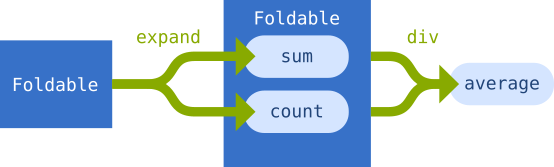

```
import {NOTE} from './_util'
```

# Declarative programming

Declarative programming is a way of dealing with complexity in your programs.
It achieves this goal by formulating the end products of computations rather
than specifying steps necessary to arrive at the result.

Before you get started with this module, you should be very comfortable with
functions in JavaScript. If you think you're all set, great! Otherwise, you
will find a refresher in the [func](./func.md) module.

In this module, we will see how declarative style can be achieved in
JavaScript, and how this can simplify our programs. We will do so without going
into too much theory, though, so you can focus on the result, and not the
tools. We do need some tools for this to work, though, and we will, introduce
tools as we go. As you will see, we don't need YASL (yet another scary library)
to get the job done.

We will also take a look at two common paradigms so that you can understand the
problem we are solving a bit better and get oriented by first looking at some
familiar code. I am hoping that showing those examples first, you will be able
to notice some issues with them, and, more importantly, how declarative style
deals with the issues.

Let's start with a very simple example. We have an array of numbers and we want
to sum them up, and also calculate their average. The numbers are:

```
const scores = [4, 2.2, 2, 3, 5.6, 4, 3.8, 4.2]
```

If we were to talk about the solution in terms of steps, it would probably go
something along these lines:

1. take the first number from the list, and remember it, and the count is 1
2. take the next number from the list, and add it to the first one, and add one
   to the count
3. repeat (2) for the remaining numbers
4. once we have the sum and the count, we divide the sum by the count to get
   the average

Let's write the code for the steps we discussed. This is how most programmers
start when they start programming.

```
let psum = 0
let pcount = 0
for (; pcount < scores.length; pcount++) {
  psum += scores[pcount]
}
let paverage = psum / pcount
NOTE('Procedural, results:')
console.log('sum is', psum) // 28.79999...
console.log('average is', paverage) // 3.5999...
```

NOTE: The weird numbers you see is the floating point precision error that is
common in many programming languages. Just imagine those are 28.8 and 3.6. ;)
This is not important for our discussion.

This is called the procedural style: you write the code as a procedure that
takes you from the start to the final goal.

As you get a bit more advanced, you may say "Oh, look, Array has a `forEach()`
function which is a much nicer way to loop over it. And I don't need the count
variable because the array has a length property which gives me the same
thing!"

```
let lsum = 0
scores.forEach(function (n) {
  lsum += n
})
let laverage = lsum / scores.length
NOTE('Procedural 2, results:')
console.log('sum is', lsum) // 28.79999...
console.log('average is', laverage) // 3.5999...
```

The second attempt looks nicer, for sure.

After you learn a bit of Java, you may do this instead:

```
class Stats {
  constructor(scores) {
    this.count = scores.length
    this.scores = scores
  }

  get sum() {
    let sum = 0
    this.scores.forEach(function (n) {
      sum += n
    })
    return sum
  }

  get average() {
    return this.sum / this.count
  }
}

const savg = new Stats(scores)
NOTE('OOP, results:')
console.log('sum is', savg.sum) // 28.79999...
console.log('average is', savg.average) // 3.5999...
```

In the object-oriented style, we enclose (technically it's 'encapsulate') the
values and associated calculations in an object. We could say that the object
represents some kind of stats with sum and average properties. We could have
also created two objects for each of these calculations, but our goal here is
not to talk about object-oriented programming and its best practices, so Java
programmers will excuse my silly OOP example.

That is just breathtakingly fancy! Classes FTW! Alas, it still does not change
the fundamental approach. If you look at it carefully, you'll see that it has
just shifted the code around a bit.

**NOTE:** Yes, I am just using these examples as strawmen to demonstrate the
downsides of using procedural and OOP paradigms *for this particular problem*
and is fully aware that there are valid cases for those paradigms for some
other problems (which he hopes not to encounter ever in his life).

> And now for something completely different.

It's going to seem a bit long and tedious, but bear with me. I'm just being
extra-verbose about the though process for demonstration purposes. In the end,
it's just a few lines of code, but code without explanation doesn't mean much.

To give you some context about what we are going to do, I'll tell you that our
main goal is to *describe* all the calculations before we ever touch the
numbers, as opposed to plowing through the numbers one by one and doing all the
intermediate steps. You can think of it as carefully setting up the dominos
(our calculations) before we hit the first one with our finger (the input).

Let's get started.

If you think about summing, it is simply a series of additions. And we know
what addition looks like:

```
const add = (x, y) => x + y
```

Summing also reduces a bunch of numbers to a single number. What we need is a
way to define the operation of reducing a thing (like a container), using some
operation (like, say, addition in our case). Let's define how this reduction
could work in our code:

```
const reduce = operation => foldable => foldable.reduce(operation)
```

As you can see from the parameter names, objects that have a `reduce()`
function are called 'foldable', because multiple values 'fold down' to a single
value.

We've written this in a somewhat weird way, but you'll see why in a bit. This
is called currying. Instead of taking all of the operational parameters at once
we feed the `reduce()` function its parameters one by one. Each time we feed
one parameter, we produce a function that is hard-coded to the parameters that
were already passed.

Now we can express the sum as a reduction using addition.

```
const sum = reduce(add)
```

What `sum()` has become is this: `foldable => foldable.reduce(add)`, a function
that takes a foldable container, and folds it using addition. With currying and
two simple generic functions, we are able to define a slightly more complex
concept. In fact, this way of breaking things down is fractal, and it goes all
the way up to fairly complex systems, while still using the same way of
thinking about things.

We won't do systems in this module, but let's take a bit more complex problem
which is the average.

**NOTE:** We can now simply calculate the sum, and derive the average by
dividing that value by the length of the array. That would be the most
practical solution in the real life. However, we will do something a bit more
complicated here as an exercise.

For the average we need the sum which we already know how to derive, and we
also need the count. The count is the length of an array, so:

```
const count = (x) => x.length
```

To calculate the average of a foldable, we need to divide its sum with
the count of its elements. We need to describe division as well, so here it
goes:

```
const div = (x, y) => x / y
```

Now we're ready to state what average is:

```
const naiveAvg = (foldable) => div(sum(foldable), count(foldable))
```

We have the average now, but it's somehow wrong. `foldable` is repeated twice,
and it definitely looks like we can get rid of it. Remember, our goal is to
describe the calculation itself, not how to perform it.

Let's break it down and analyze what's going on.

We have three things in this calculation. We have the count, the sum, and the
division. Count and sum are both calculated from the same foldable, but they
represent different calculations. We can think of it as some kind of branching.
The division, on the other hand, reduces two things into one value, so just
like add, it would make sense that it could operate on a foldable. If we could
somehow transform the original foldable into another foldable that has sum and
count as its members, we might be able to simplify the problem. Graphically, it
would look something like this:



We will first define the transformation for sum and count.

```
const expand = (...ops) => x => ops.map(op => op(x))
```

The `expand()` function takes a number of operations, and returns a function
that takes a single value. The returned function will pass the value to each of
the operations and return an array of results. Since arrays are foldable, we
can call div on it. But we can't use our `div()` function as is, as it does not
work on foldables yet, so we will need to define a new one.

```
const division = reduce(div)
```

It's now time to write the final version of the average function. We just need
one more little thing. We need a way to combine functions.

```
const combine = (f, g) => (...args) => f(g(...args))
const compose = (...fns) => reduce(combine)(fns)
```

The first of the two functions we have introduced describes how we can combine
two functions. The second function takes a collection of functions and reduces
them to the combined version.

I think you are already seeing a pattern here, but we'll get into that a bit
later.

And (drumrolls), the average function:

```
const average = compose(division, expand(sum, count))
```

And just like that, we drove `foldable` out of our original function. Here are
the two versions side by side:

    old: (foldable) => div(sum(foldable), count(foldable))
    new: compose(divide, expand(sum, count))

Now the `average()` function only describes the calculation, and does not deal
with data at all anymore! Keep in mind that both versions are doing *exactly
the same thing*, but they are constructed in a different way to break down the
problem into smaller parts, so we can really deeply think about how it all
works.

Since the code was fragmented with narrative a lot, let's collect it in one
place:

    // Reusable utitilies
    const reduce = operation => foldable => foldable.reduce(operation)
    const combine = (f, g) => (...args) => f(g(...args))
    const compose = (...fns) => reduce(combine)(fns)
    const expand = (...ops) => x => ops.map(op => op(x))

    // Generic calculations
    const div = (x, y) => x / y
    const add = (x, y) => x + y
    const count = (x) => x.length

    // Derived calculations
    const sum = reduce(add)
    const division = reduce(div)
    const average = compose(division, expand(sum, count))


Let's give these a try:

```
NOTE('Declarative, results:')
console.log('sum is', sum(scores))
console.log('average is', average(scores))
```

I have mentioned this time and again, but the whole adventure we went through
had only one goal: drive the data out of our functions and focus on the
behavior (calculations). The data, in this case, is the `scores` array that we
call 'foldable'.

We did not actually get rid of foldables completely. There is one place that
deals with them, and that's the `reduce()` function. Crucially, it's the one
and only one place where we ever talk about it, and we talk about it in a very
generic way: 'how to work with foldables in general'. As you can see from our
code, we were able to apply this concept in multiple places.

Now I mentioned something about a pattern earlier. When you have an operation
that is performed on two values of the same type (e.g., number, string,
function, etc) and produces a single value of the same type, you can always use
such operations (functions) to reduce foldables such as arrays. We had three
examples of this:

- sum reduces a foldable to a number using addition that takes two numbers
  and returns a single number
- division reduces a foldable to a number using an operation that takes two
  numbers and returns a single number
- compose reduces a foldable to a single function using an operation that
  takes two functions and returns a single function

Arrays in JavaScript are foldables, and they have a `reduce()` function that
can be used to reduce the entire array to a single value. There is no reason
why you can define your own objects that implement the `reduce()` function,
though, and can be reduced to a single value in a way that makes sense to them.

There is a similar pattern called 'functors', which are objects that have a
`map()` function and that for each member they contain return the same number
of members that are transformed using a supplied operation. We used this
pattern in our `expand()` function, where we had a functor containing two
functions which were transformed into their return values. As you may have
guessed, an array in JavaScript is also a functor. As with foldables, you can
define your own functors and use them in a variety of ways.

Although we have not seen it in this example, map and reduce are often used in
a tandem, to translate the data into an easily reducible form, and then
summarize it in some way.

Another take-away is that, although we have produce a bit more lines of code
than the procedural counterpart, we have also been able to clearly delineate
generic and concrete operations (functions). For example, functions like
`reduce()`, `compose()`, and `add()`, are clearly generally useful in most
programs we may write (in fact, there are many libraries that already provide
them, and we could have simply used one of them instead of writing our own). If
we factor all our generic functions out, we are left with only three lines of
code that are directly related to the problem we are solving.

In this module, we have touched on the topic of 'kinds of things' that we pass
to our functions, as well as the 'kind of functions' (e.g., function that takes
two numbers and returns one number). In fact, we do that a lot in this
programming style. These 'kinds' are formally known as types, and we can see
that declarative programming and types kind of fit together nicely. JavaScript
is not a statically typed language, and the burden of reasoning types falls
squarely on the programmer. There are ways to introduce static typing into
JavaScript, though, and we will look at them in future modules.

Finally, looking at our code, you will probably agree that each of the
functions are very, very short and relatively easy to reason about provided you
know what the underlying code is doing. There are, of course, drawbacks too.
For example, if you *don't* know what `reduce()` or `compose()` do, you may not
understand what `reduce(div)` and some of the other derived functions may do.
At least until you get used to this style of programming, you should know that
it's not an either-or choice, and you can always use and of the other styles
where clarity (at least for you) appears to be compromised.
